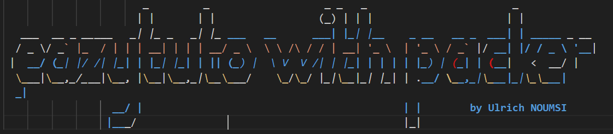
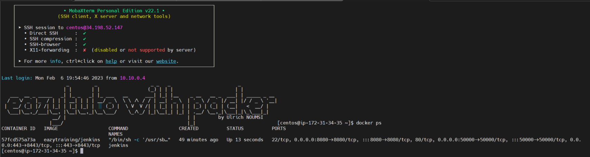
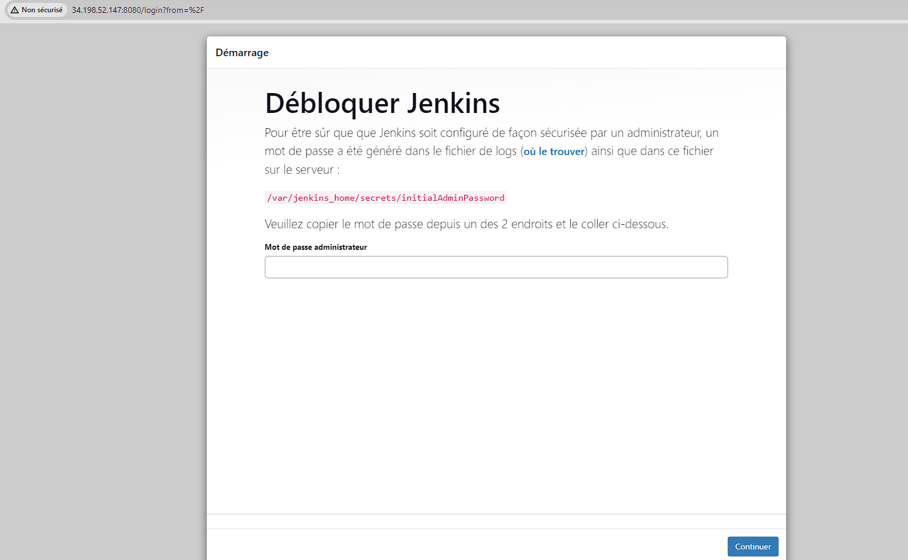

# Objectives
Building AMIs for our cloud providers to save time in provisioning our different stacks, whether in a corporate or personal work environment.

# Prerequisites
- Packer installation
- Terraform installation
- Having an account with a cloud provider (AWS in our case) + available access key and secret key
- Installing AWS CLI on your server or workstation
- Retrieving the source code
- To retrieve the source code, you have two options:

The first is to simply clone the repository
```bash
git clone https://github.com/ulrich-sun/eazytuto-packer.git
```
The second is to fork it The advantage of forking is that you can propose improvements to my code.
# Launching the stack
## Building the AMI
```bash
cd eazytuto-packer
packer init eazytuto.pkr.hcl && packer fmt eazytuto.pkr.hcl && packer validate eazytuto.pkr.hcl  && packer build eazytuto.pkr.hcl
```
## Creating an AWS instance
- Retrieve the new AMI
- Replace in the Terraform code
- Launch the instance creation
```bash
cd eazytuto-packer/terraform
terraform init 
terraform plan
terraform apply -auto-approve
```
Wait a few minutes depending on the power of your machine and your internet connection.

# Testing the VM
- Retrieve the IP address displayed on the screen
- Connect to the VM using a secure connection tool (mobaxterm, Putty) or simply use your cmd or CLI
``` bash
ssh centos@ip_address
```
- Enter the password: eazytuto
- Once connected, check if Jenkins is up and running
```bash
docker ps 
```
Open a browser and paste your ip_address:8080
# Result


